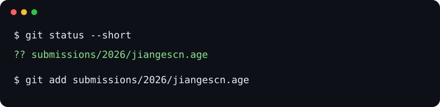

# 第一次向招新仓库提交 Pull Request

任务：**用仓库里的工具加密你的通知邮箱，再把生成的 `.age` 文件提交给 wustLABA**。

我们之后会用这个邮箱发送面试通知。

## 0. 准备

你需要一个 GitHub 账号和 Git。Windows 可从 [Git 官网](https://git-scm.com/download/win)安装；

macOS 可先在“终端”里运行 `git --version`，若系统提示安装命令行开发者工具，按提示完成。

安装 Git 后，Windows 打开 PowerShell，macOS 打开“终端”，输入：

```sh
git --version
```

如果能看到版本号，就可以继续。

## 1. Fork 仓库

打开本仓库 <https://github.com/wustLABA/wustlaba-recruit>，点页面右上角的 **Fork**，将仓库复制到你自己的 GitHub 账号下。


完成后，浏览器地址应类似：

```text
https://github.com/你的GitHub用户名/wustlaba-recruit
```

## 2. Clone 到电脑

在**你自己的 Fork** 页面点击绿色 **Code** 按钮，选择 **HTTPS**，复制仓库地址。


截图中的 `jiangescn` 是示例用户名；你复制的地址应显示**你自己的 GitHub 用户名**。然后在 PowerShell 或 macOS“终端”中运行：

```sh
git clone <刚才复制的 HTTPS 地址>
cd wustlaba-recruit
```

例如，截图中的用户名是 `jiangescn`，地址就是 `https://github.com/jiangescn/wustlaba-recruit.git`。命令中的引号可以保留。

## 3. 创建分支

```sh
git switch -c submit-email
```

分支让这次提交与主线分开，等待负责人审核。

## 4. 生成加密文件

在仓库目录中，按自己的系统运行下面**一条**命令：

Windows PowerShell：

```powershell
powershell -NoProfile -ExecutionPolicy Bypass -File .\submit.ps1
```

macOS“终端”：

```sh
bash ./submit.sh
```

脚本会从你 Clone 的 Fork 地址识别 GitHub 用户名，然后提示输入通知邮箱。成功后会显示一个文件名，例如：

```text
submissions/2026/jiangescn.age
```

这个文件是加密后的内容。**不要把邮箱明文写进仓库文件、Commit 信息或 PR 描述。**

## 5. Commit 并 Push

先看这次改了什么：

```sh
git status
```

你应能看到 `submissions/2026/你的用户名.age`（年份按提交时的当前年份自动确定）。下图里的 `jiangescn` 只是示例：



将下面命令中的 `jiangescn` 换成脚本显示的文件名对应的用户名：

```sh
git add submissions/2026/jiangescn.age
git commit -m "Submit encrypted email"
git push -u origin submit-email
```

如果 `git commit` 提示未设置身份，按提示设置 `user.name` 与 `user.email`，再重试 Commit。Push 时按 Git 显示的认证提示登录 GitHub；若终端要求输入密码，GitHub 需要使用[个人访问令牌](https://docs.github.com/en/get-started/git-basics/why-is-git-always-asking-for-my-credentials)，不能输入 GitHub 账号密码。

## 6. 创建 Pull Request

回到你自己的 Fork 页面，通常会看到 **Compare & pull request** 按钮：


点击后确认：

- **base repository**：`wustLABA/wustlaba-recruit`
- **base branch**：`main`
- **head repository**：你自己的 Fork
- **compare branch**：`submit-email`

如果 GitHub 自动选中其他目标仓库，请将 **base repository** 改为 `wustLABA/wustlaba-recruit`。

标题可写 `Submit encrypted email`，描述可写 `已按教程提交加密邮箱`。最后点击 **Create pull request**。

负责人会检查并合并。如果收到评论，请直接在原 PR 里回复；需要重做加密文件时，重新运行第 4 步中对应系统的脚本，再 Commit 和 Push 到同一个分支，PR 会自动更新。

## 遇到问题

- 请在issue中提问，这里是你唯一可以获取关于这次作业帮助的地方

---

# 可选：加入 wustLABA 组织

> **这一节是可选环节，不影响招新作业。** 如果你希望加入我们的 GitHub 组织、参与社团项目，可以按这里自助申请。

加入后你就成为组织成员，能看到并参与社团的公开项目，不再是旁观者。

## 权限是怎么来的？

先理解这点能帮你少走弯路：

```text
wustLABA Organization（我们的组织）
        ↓
LABA-Members Team（成员团队）
        ↓
项目权限：可以参与某些仓库
   ├─ first-contributions
   ├─ wustlaba-recruit（就是本仓库）
   └─ 其他社团项目
```

你申请的**是加入组织**，而不是某一个仓库的单独权限。加入组织后你会自动进入 **LABA-Members** 团队，从而获得团队当前已配置的那批仓库的权限。

好处是：一次加入，后续都能参与。今后社团新增项目时，管理员把仓库挂到团队上即可，你无需重新申请。

## 申请步骤

### 第一步：打开申请页面

进入 **first-contributions** 仓库的申请页面：

<https://github.com/wustLABA/first-contributions/issues/new?template=laba-contribution-access.yml>

也可以先进仓库首页 <https://github.com/wustLABA/first-contributions>，点 **Issues → New issue**，再选择「申请加入 wustLABA Organization」。

### 第二步：勾选确认框，提交

页面上**只有一个地方需要你操作**：勾选那个确认框，然后点 **Submit new issue**。

你**不需要**填写 GitHub 用户名、姓名、学号、班级或邮箱——系统会自己读取你的账号。

> ⚠️ **这个 Issue 是公开的，所有人都能看到。**
> 请**不要**在里面填写姓名、学号、班级、手机号、邮箱等任何隐私信息；
> 也**绝对不要**提交密码、Token、身份证号之类的敏感内容。

### 第三步：等待机器人处理

提交后通常几秒内就会有回复：

| 你看到的内容 | 意思 |
| --- | --- |
| 组织加入申请已处理 | 成功，邀请已发出，去接受就行 |
| 待接受的组织邀请 | 你之前申请过还没接受，去接受即可，不会重复发 |
| 你已经是组织成员 | 你已经在里面了，无需重复申请 |

处理成功后，这个 Issue 会自动关闭。

### 第四步：接受邀请

去下面任一位置接受邀请：

- **GitHub 网页**：右上角的通知铃铛 🔔
- **你的邮箱**：找一封来自 GitHub 的邀请邮件
- **直接打开**：<https://github.com/orgs/wustLABA/invitation>

> ⚠️ **没接受邀请就不算加入成功。** 这是最常见的卡点——只提交了 Issue 但没点接受，权限不会生效。
>
> 另外，接受之后权限可能还要**等几秒到几分钟**才完全生效，稍等一下即可。

## 常见问题

### Q：收不到邀请怎么办？

依次检查：

- **GitHub 通知**：点网页右上角的铃铛 🔔
- **注册邮箱**：翻一下垃圾邮件文件夹，发件人是 GitHub
- **申请 Issue 的状态**：回到你提交的那个 Issue，看机器人回复了什么

如果 Issue 上标着失败标签，说明需要管理员人工处理，**等着就好，不要重复开新的 Issue**。

### Q：我提交申请了，为什么还是没加入成功？

大概率是**没接受邀请**。去 <https://github.com/orgs/wustLABA/invitation> 看看有没有待接受的邀请。接受之后如果还没生效，等几分钟再试。

### Q：我可以提交多次申请吗？

可以，但**不会重复收到邀请**。系统会认出来你已经有一条待接受的邀请，然后提醒你去接受。如果你已经在组织里，它会告诉你无需重复申请。

### Q：加入组织后我能做什么？

能参与 LABA-Members 团队当前挂载的仓库，目前包括 `first-contributions`、`wustlaba-recruit` 等。具体范围由管理员维护。组织内未挂载到该团队的仓库，你依然没有权限。

### Q：我有问题可以开 Issue 问吗？

`first-contributions` 仓库为了保持申请流程的可识别性，**关闭了自由格式的 Issue**。需要帮助时，请到**本仓库** <https://github.com/wustLABA/wustlaba-recruit/issues> 提问——这里是你获取帮助的地方。

---

**完整的中文详细指南**见：
<https://github.com/wustLABA/first-contributions/blob/main/docs/zh-CN/laba-access.md>
